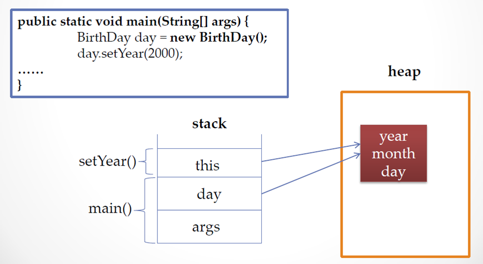

# 12. 객체 자신을 가리키는 this

## this가 하는 일

- 인스턴스 자신의 메모리를 가리킴

- 생성자에서 또 다른 생성자를 호출 할때 사용

- 자신의 주소(참조값)을 반환 함


## 생성된 인스턴스 메모리의 주소를 가짐

- 클래스 내에서 참조변수가 가지는 주소 값과 동일 한 주소 값을 가지는 키워드



``` 
public void setYear(int year)
{
    this.year = year;
}
```