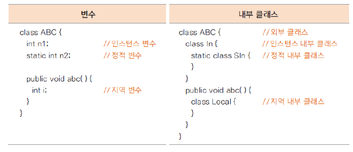

# 01. 여러 내부 클래스의 정의와 유형

## 내부 클래스란? (inner class)

- 클래스 내부에 선언한 클래스로 이 클래스를 감싸고 있는 외부 클래스와 밀접한 연관이 있는 경우가 많고, 

다른 외부 클래스에서 사용할 일이 거의 없는 경우에 내부 클래스로 선언해서 사용함

- 중첩 클래스라고도 함

- 내부 클래스의 종류

인스턴스 내부 클래스, 정적(static) 내부 클래스, 지역(local) 내부 클래스, 익명(anonymous) 내부 클래스

- 변수와 비교한 내부 클래스



## 인스턴스 내부 클래스

- 내부적으로 사용할 클래스를 선언 (private으로 선언하는 것을 권장)

- 외부 클래스가 생성된 후 생성됨 ( 정적 내부 클래스와 다름 )

- private이 아닌 내부 클래스는 다른 외부 클래스에서 생성할 수 있음

```
OutClass outClass = new OutClass();
OutClass.InClass inClass = outClass.new InClass();
```

- 인스턴스 내부 클래스 예

```
class OutClass {

	private int num = 10;
	private static int sNum = 20;
	private InClass inClass;
	
	public OutClass(){
		inClass = new InClass(); // 내부 클래스 생성
	}
	
	class InClass{
		
		int inNum = 100;
		//static int sInNum = 200;  //에러 남
		
		void inTest(){
			System.out.println("OutClass num = " +num + "(외부 클래스의 인스턴스 변수)");
			System.out.println("OutClass sNum = " + sNum + "(외부 클래스의 스태틱 변수)");
			System.out.println("InClass inNum = " + inNum + "(내부 클래스의 인스턴스 변수)");
		}
		
	    //static void sTest(){  //에러 남
	    	
	    //}
		
	}
	
	public void usingClass(){
		inClass.inTest(); //내부 클래스 변수를 사용하여 메서드 호출하기
	}
}

public class InnerTest {

	public static void main(String[] args) {
		OutClass outClass = new OutClass();
		System.out.println("외부 클래스 이용하여 내부 클래스 기능 호출");
		outClass.usingClass();    // 내부 클래스 기능 호출
	    System.out.println();
	    
		OutClass.InClass inClass = outClass.new InClass();   // 외부 클래스를 이용하여 내부 클래스 생성
		System.out.println("외부 클래스 변수를 이용하여 내부 클래스 생성");
		inClass.inTest();
	}

}
```


## 정적 내부 클래스


## 지역 내부 클래스


## 익명 내부 클래스


