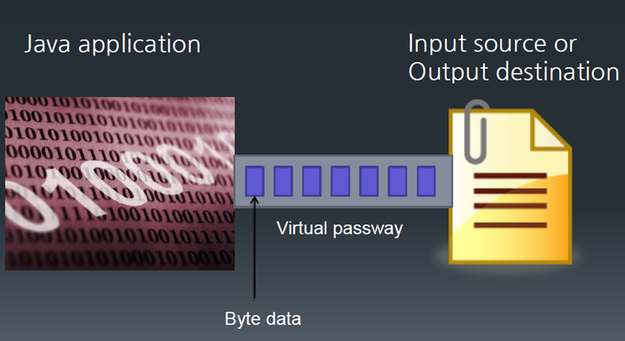

# 12. 자바의 입출력을 위한 I/O 스트림

## 입출력 스트림

- 네트워크에서 자료의 흐름이 물의 흐름과 같다는 비유에서 유래됨

- 자바는 다양한 입출력 장치에 독립적으로 일관성있는 입출력을 입출력 스트림을 통해 제공

- 입출력이 구현되는 곳: 파일 디스크, 키보드, 마우스, 네트웍, 메모리 등 모든 자료가 입력되고 출력되는 곳

## 입출력 스트림의 구분

- 대상 기준 : 입력 스트림 / 출력 스트림

- 자료의 종료 : 바이트 스트림 / 문자 스트림

- 기능 : 기반 스트림 / 보조 스트림

## 입력 스트림과 출력 스트림

- 입력 스트림 : 대상으로 부터 자료를 읽어 들이는 스트림

- 출력 스트림 : 대상으로 자료를 출력하는 스트림

- 스트림의 종류

| 종류 | 예시 |
| ------ | ------ |
| 입력 스트림 | FileInputStream, FileReader, BufferedInputStream, BufferedReader 등 |
| 출력 스트림 | FileOutputStream, FileWriter, BufferedOutputStream, BufferedWriter 등 |

